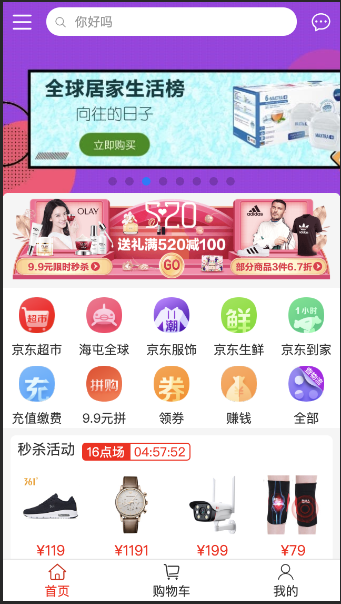

<!--
 * @Description: In User Settings Edit
 * @Author: your name
 * @Date: 2019-09-24 09:17:10
 * @LastEditTime : 2019-12-19 11:05:29
 * @LastEditors  : Please set LastEditors
 -->
# shopapp

## show demo



## Project setup
```
npm install
```

### Compiles and hot-reloads for development
```
npm run serve
```

### Compiles and minifies for production
```
npm run build
```

### Run your tests
```
npm run test
```

### Lints and fixes files
```
npm run lint
```

### Customize configuration
See [Configuration Reference](https://cli.vuejs.org/config/).